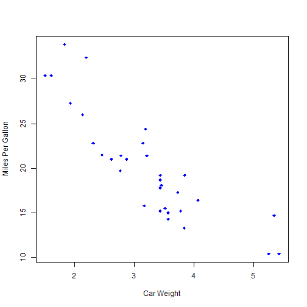
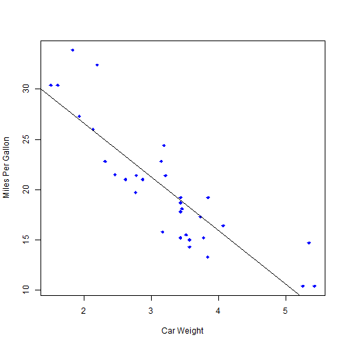
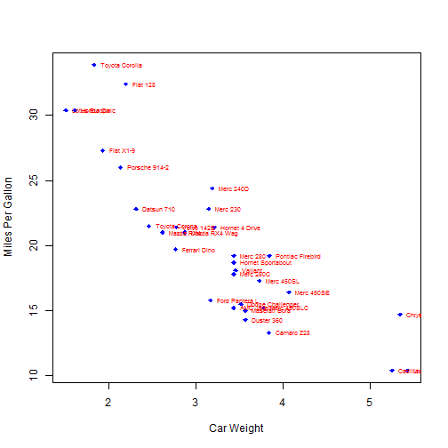

## The Relationship Between a car's Weight and MPG

1. How are the relationship between a car's Weight and MPG?
2. How does the linear relation between them look?
3. Is your car on the list?

--- .class #id 

## Scatter Plot

View a Scatter plot 

--- .class #id 

## Regression Line

Draw a best fit regression line

--- .class #id 
 
## Label the Points

 
Label the points to see if your car is in the plot.

